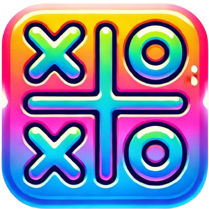

<p align="center">
  
</p>

<p align="center">
  
</p>

<p align="center">
  A two-player local Tic Tac Toe Android app built with Java & Android Studio.
</p>

---

## Features

- Enter custom player names before starting
- Interactive 3×3 grid with X and O icons
- Win detection (rows, columns, diagonals)
- Draw detection
- Animated turn highlighting
- Restart dialog after each game

## Tech Stack

- **Language:** Java
- **IDE:** Android Studio
- **Build system:** Gradle
- **Min SDK:** Android 5.0 (API 21)
- **Target SDK:** API 31

## Project Structure

```
TicTacToe/
├── app/
│   ├── src/main/
│   │   ├── java/com/example/tictactoe/
│   │   │   ├── addPlayers.java       # Player name input screen
│   │   │   ├── MainActivity.java     # Core game logic
│   │   │   ├── winDialogue.java      # Win/draw result dialog
│   │   │   └── AboutUsActivity.java  # About page
│   │   ├── res/                      # Layouts, drawables, strings
│   │   └── AndroidManifest.xml
├── build.gradle
└── settings.gradle
```

## How to Build & Run

### Prerequisites
- [Android Studio](https://developer.android.com/studio) (Hedgehog or newer)
- JDK 11+
- An Android device or emulator (API 21+)

### Steps

1. **Clone the repo**
   ```bash
   git clone https://github.com/YOUR_USERNAME/TicTacToe.git
   cd TicTacToe
   ```

2. **Open in Android Studio**
   - Launch Android Studio → `File > Open` → select the project folder

3. **Sync Gradle**
   - Android Studio will prompt you to sync — click **Sync Now**

4. **Run the app**
   - Connect a device via USB (enable USB debugging) or start an emulator
   - Click the ▶ **Run** button or press `Shift + F10`

### Build a release APK (optional)
```
Build > Build Bundle(s) / APK(s) > Build APK(s)
```
The APK will be generated at `app/build/outputs/apk/debug/app-debug.apk`


## What's Next (Planned Improvements)

- [ ] AI opponent using Minimax algorithm
- [ ] Cumulative score tracking
- [ ] Material Design 3 UI
- [ ] Game save & resume
- [ ] Multilingual support (FR / EN)

## Authors

- **Ahmed BENLAFQIH**

---

*2024–2025 — 2A SIE*
